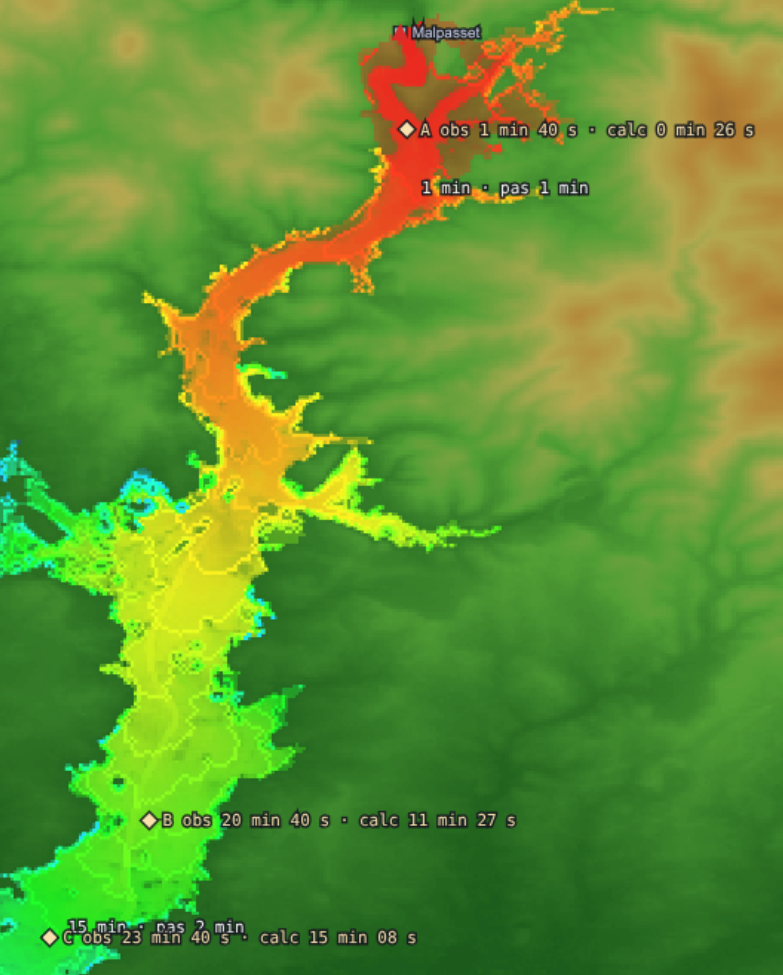

<!-- ═══════════════════════════════════════════════════════════════════
     FICHIER : README.md - v27/09/2026
     OBJET   : présentation du projet pour GitHub
     AUTEUR  : Eric P.
     RELECTURE : Opus 5.5
     LICENCE : CC BY-NC 4.0 — source à citer : https://github.com/ericperret/crest/
               usage commercial interdit sauf accord écrit de l'auteur (voir LICENSE)
     ═══════════════════════════════════════════════════════════════════ -->

# crest — relief, ombres et paléoglaciers dans le navigateur

Dépôt : <https://github.com/ericperret/crest/>

Visualiseur de modèle numérique de terrain (Copernicus GLO-30) et simulateur
de glacier sur le dernier cycle climatique (−30 000 ans → aujourd'hui).

HTML, CSS et JavaScript uniquement : **aucune librairie, aucun serveur,
aucune installation**. On ouvre `map.html` dans un navigateur récent, c'est
tout. Les seuls accès réseau sont les fonds de carte (tuiles Esri et Carto).

---

## Ce que fait l'outil

**Carte des tuiles (`map.html`)**
- Grille mondiale des tuiles Copernicus 1°×1° ; les tuiles présentes dans
  le dossier local apparaissent en vert.
- Commande AWS S3 prête à copier pour télécharger les tuiles manquantes.
- Clic sur une tuile : ouverture dans le visualiseur.
- Sélection d'une zone rectangulaire à cheval sur plusieurs tuiles :
  mosaïque assemblée, rendue carrée, envoyée au visualiseur.

**Visualiseur (`dsm.html`)**

| Bouton | Fonction |
|---|---|
| ⇄ Courbes de niveau | Hypsométrie égalisée ou courbes de niveau |
| 🌑 Ombre | Horizons sur 64 azimuts, ombres portées heure par heure |
| ☀️ Insol | Insolation directe annuelle, horizon et orbite de l'époque compris |
| 🌡 Temp | Température moyenne annuelle (anomalie paléo + gradient) |
| ⛰ Partage | Lignes de partage des eaux entre les quatre bords |
| 🕸 Fil / 🗻 3D | Filet adaptatif de facettes, vue 3D en fil de fer |
| ❄️ Glacier | Simulation glaciaire complète (voir plus bas) |
| ➡ Flux | Flèches d'écoulement de la glace |
| 🗺 Carto | Étiquettes géographiques superposées |
| 🎬 Vidéo 365j | Film AVI des ombres au lever, un jour par image |
| ⏺ REC | Enregistrement WebM de l'écran |

Panneau de contrôle : **année** (−20 000 à 2100), **jour**, **heure
solaire**. Clavier : ↑↓ choisit le curseur, ←→ modifie la valeur.

Témoins d'état, courbe d'anomalie de température de l'époque, profileur
intégré et légende cartographique du glacier (glace, névé, fronts).

---

## Démarrage

1. Télécharger une ou plusieurs tuiles Copernicus GLO-30. La commande est
   donnée par `map.html` (bouton ☁️ ou clic sur une tuile absente), par
   exemple :
   ```
   aws s3 sync s3://copernicus-dem-30m/Copernicus_DSM_COG_10_N45_00_E006_00_DEM/ \
       ./Copernicus_DSM_COG_10_N45_00_E006_00_DEM/ \
       --no-sign-request --exclude "*" --include "*_DEM.tif"
   ```
   Aucun compte AWS n'est nécessaire (données publiques).
2. Ouvrir `map.html`, bouton **📂 Ouvrir copernicus/**, choisir le dossier.
3. Cliquer une tuile verte, ou **🔲 Sélection zone** puis **✔ Charger la
   zone**. Le visualiseur s'ouvre dans un nouvel onglet (autoriser les
   fenêtres surgissantes pour ce fichier).
4. Dans `dsm.html` : **🌑 Ombre** d'abord (calcule les horizons, requis par
   Insol, Temp et Glacier), puis les autres fonctions.

Navigateur : Chrome, Edge ou Firefox récents (Workers, OffscreenCanvas,
DecompressionStream, BroadcastChannel).

---

## La simulation glaciaire

Au démarrage : 10 ans figés à −30 ka, puis un pas de 5 jours jusqu'en 2026
(1 an simulé = 1/1000 ka de forçage).

| Étape | Module | Modèle |
|---|---|---|
| Orbite | `dsm-astro.js` | Laskar 2004, équation du centre de Berger 1978 |
| Température | `dsm-temp.js` | Anomalie de forage nord/sud pondérée en latitude, 6,5 °C/km, cycle saisonnier et diurne |
| Précipitation, foehn | `dsm-foehn.js` | Smith & Barstad 2004 par tranches d'altitude (FFT), foehn thermodynamique |
| Ensoleillement | `dsm-insol.js` | Rayonnement direct, horizons, 73 cartes par an |
| Maillage | `dsm-filet.js` | Quadtree adaptatif, facettes à cône de normales borné |
| Bilan de masse | `dsm-worker-glacier.js` | Degrés-heures en forme fermée, neige → glace par tassement |
| Glissement basal | `dsm-basal.js` | Température du lit, régimes gelé / tempéré / surge |
| Écoulement | `dsm-flux.js` | SIA implicite (Glen n = 3), Picard, gradient conjugué préconditionné |
| Parallélisme | `dsm-worker-flux.js` | Un Worker par bassin versant (4 bassins indépendants) |

Chien de garde : si une étape dépasse 15 s, la barre d'état et la console
indiquent l'étape, le pas et l'état du solveur.

---

## Clic droit : robinet, lave, rupture de barrage

Les barrages connus de l'emprise (CFBR, puis Global Dam Watch, puis FAO
AQUASTAT, sans doublon) sont posés sur la carte dès le chargement (carré
cyan, nom écrit quand 40 repères au plus sont visibles, survol : nom,
hauteur, volume). Le clic droit ouvre un menu ; sur un repère, la première
entrée lance directement la rupture de cet ouvrage.

- **Robinet** : remplissage doux depuis le point cliqué (bassins
  successifs, seul le bassin le plus aval monte), jusqu'à la mer, au bord
  de la carte ou à une cuvette fermée. Sert aussi de trajectoire de
  référence à la rupture de barrage.
- **Lave** : à venir.
- **Rupture de barrage** : propose les barrages connus à moins de 30 km
  (CFBR en priorité, puis Global Dam Watch, puis FAO AQUASTAT), ou la saisie
  du volume (km³) et de la hauteur d'eau (m) au point cliqué. Cas le pire :
  retenue pleine, rupture instantanée et totale, sol nu, lit aval sec. Seul
  l'aval est modélisé : le cas pire est une convention (physiquement
  impossible) destinée à donner aux populations des temps d'arrivée en
  avance, donc avec de la marge.

| Étape | Modèle |
|---|---|
| Ouvrage | Pied trouvé sur le chemin du robinet : parement aval repéré dans le DSM (pente > 1/5, USBR 1987), retenue pleine = pied + hauteur ; ouvrage détruit (absent du DSM) : pied au repère de la fiche |
| Brèche | Totale et instantanée, sur toute la largeur de la vallée sous le niveau de la retenue au pied de l'ouvrage (ou sur la longueur de digue connue) ; ligne de digue étanche ailleurs |
| Retenue | Réservoir à niveau horizontal (level-pool, Fread 1988) de volume V et hauteur h0 ; niveau imposé à la brèche, débit sortant calculé par le schéma (écoulement critique dès l'ouverture, cas le pire) ; la cuvette amont est hors domaine (murs), l'onde aval ne peut ni l'envahir ni s'étaler sur la surface du lac du DSM |
| Onde | Saint-Venant 2D : lame h et vitesse (u, v) en chaque pixel à chaque instant ; schéma décalé conservatif de Stelling & Duinmeijer (2003), transport transverse sous la même forme (Kramer & Stelling 2008) ; l'inertie porte l'eau tout droit dans les virages, la rive la freine (montée ≤ V²/2g), rien n'est imposé en plus |
| Frottement | Fond : Manning (1891), n = 0,020 s·m⁻¹ᐟ³ (sol nu), semi-implicite par face (freine sans inverser la vitesse, stable en lame mince) ; eau sur eau : viscosité turbulente de Smagorinsky (1963), Cs = 0,17 (Lilly 1967) |
| Bords | Mer (z ≤ 0,5 m) et bords de carte : l'eau sort du domaine ; sans donnée : mur |
| Datation | Arrivée du front par pixel (lame ≥ 10 cm) à chaque pas de calcul (CFL 0,5) |
| Isochrones | Pas de 1 min, allongé (2, 5, 10… 120 min) dès que deux fronts successifs sont à moins de 10 pixels ; front = pixel atteint le plus loin du pied |
| Fin | Plus aucun pixel atteint pendant 1 h (48 h au plus) |
| Validation | `BARRAGE_FABRIQUE().essaiRitter()` : solution de Ritter (1892), sans frottement ; lame au droit du barrage à 1 % près, masse conservée à 10⁻¹⁵, front de 10 cm en retard de 10 à 14 % (diffusion numérique du premier ordre) ; cas réel : Malpasset 1959 (ci-dessous) |

**Affichage vivant** : pendant le calcul, l'emprise se dessine au fil du
temps simulé (couleur = date d'arrivée, rouge tôt → violet tard ; opacité
forte tant que l'eau est présente, croissant avec la lame de 0,1 à 10 m ;
opacité faible après retrait). Barre d'état : temps, front, débit à la
brèche, part restante de la retenue.

**Rejeu** (calcul terminé) : lecture / pause, curseur de temps, vitesse
1 min/s à 1 h/s ; les isochrones apparaissent à mesure. Lames interpolées
entre clichés à la minute (pas doublé si la mémoire des clichés dépasse
6·10⁷ lames).

**Cas d'essai Malpasset (Fréjus, 2 décembre 1959)**

Fiche CFBR marquée « détruit » : V = 0,055 km³ (benchmark CADAM), h = 60 m
(retenue à la cote 100 m), départ au repère. Trois points de mesure sont
posés sur la carte (losanges jaunes) : les transformateurs EDF A, B et C
dont la coupure a daté le passage de l'onde. Coordonnées du benchmark
(BASEMENT v3, table 5) ramenées du repère local en WGS84 : origine au
milieu de la ligne de barrage, rotation 5° calée sur le lit du Reyran,
±200 m. En fin de calcul, le temps d'arrivée est lu au point (pixel atteint
le plus proche à moins de 200 m sinon) et comparé au temps observé : barre
d'état, console (`console.table`), étiquette du losange.



| Point | Distance | Observé | Heure EDF | Calculé (n = 0,020) | Écart |
|---|---|---|---|---|---|
| A | 0,9 km | 1 min 40 s | 21 h 13 | 26 s | −74 % |
| B | 7,3 km | 20 min 40 s | 21 h 34 (entrée de Fréjus) | 11 min 27 s | −45 % |
| C | 8,5 km | 23 min 40 s | ≈ 21 h 35 (parc HT nord de Fréjus) | 15 min 08 s | −36 % |

Le modèle est en avance partout, ce qui est le sens voulu. L'avance se
construit entre A et B : de B à C, dans la plaine, le calcul met 3 min 41 s
contre 3 min observées. Causes retenues : le DSM est celui d'aujourd'hui
(vallée ravinée par l'onde de 1959, plus pentue et plus lisse dans son
premier kilomètre, plateforme de l'A8), alors que les modèles de référence
partent de la carte IGN de 1931 ; frottement de sol nu (0,020 contre 0,033
dans les références) ; eau claire. Au départ, 880 m en 26 s (≈ 34 m/s),
de l'ordre de la célérité de Ritter 2√(g·h0) ≈ 48 m/s.

**Export ⬇ Shapefile** : ZIP (.shp .shx .dbf .prj .cpg), WGS84
géographique (EPSG:4326), une entité polygone par tranche d'arrivée
(isochrones, puis, une fois le front arrêté, remplissage latéral au pas du
dernier isochrone), contours exacts des pixels sans simplification.

| Champ | Contenu |
|---|---|
| T_DEB_MIN, T_FIN_MIN | Le front atteint la tranche entre ces deux dates (min après rupture) |
| T_FIN_HM | T_FIN en hh:mm |
| PAS_MIN | Pas d'isochrone de la tranche |
| SURF_HA, NB_PIX | Surface (sphère authalique WGS84), nombre de pixels |
| H_MAX_M, V_MAX_MS | Lame et vitesse maximales atteintes dans la tranche |
| BARRAGE, V_KM3, H0_M, Q_MAX_M3S | Scénario : ouvrage, volume, hauteur, débit de pointe à la brèche |

Survol : temps d'arrivée, lame à l'instant affiché, lame et vitesse
maximales. Durées écrites « 45 min » sous une heure, « 1 h 10 » au-delà.
Espace ou ✕ : efface.

---

## Fichiers

```
map.html               carte des tuiles, assemblage de zones
dsm.html               visualiseur et boucle glaciaire
dsm-carte.js           carte tuilée Web Mercator native (remplace Leaflet)
dsm-worker-tiff.js     lecture GeoTIFF (Worker), hypsométrie, courbes
dsm-astro.js           orbite paléo, lever/coucher, position du Soleil
dsm-ombre.js           horizons, ombres, film des ombres
dsm-insol.js           insolation directe (pool de Workers)
dsm-temp.js            climat de surface
dsm-partage.js         lignes de partage des eaux (priority-flood)
dsm-mesh.js            maillage régulier et facettes (statistiques)
dsm-filet.js           filet adaptatif du glacier
dsm-fil3d.js           vue 3D du filet
dsm-foehn.js           précipitation orographique et foehn
dsm-worker-glacier.js  bilan de masse (pool de Workers)
dsm-basal.js           glissement basal
dsm-flux.js            écoulement de la glace
dsm-worker-flux.js     écoulement parallèle par bassin
dsm-barrage.js         menu du clic droit, choix du barrage, dessin
dsm-worker-barrage.js  onde de rupture (Worker), isochrones
dsm-export-shp.js      export Shapefile de l'emprise datée
dsm-barrages-cfbr.js   grands barrages français (CFBR), cas d'essai Malpasset
dsm-barrages-gdw.js    barrages mondiaux (Global Dam Watch v1.0)
dsm-barrages-fao.js    barrages mondiaux complémentaires (FAO AQUASTAT)
malpasset-essai.png    capture du cas d'essai Malpasset (README)
```

Tous les fichiers sont à placer dans le même dossier. Chaque source porte
un cartouche et chaque fonction un commentaire entrée → traitement → sortie
avec une ligne « ALGO ».

---

## Limites connues

- Simulation « robinet » (clic droit) : écoulement mono-direction (D8), une
  seule sortie par seuil ; passage sous obstacle si la surface dépasse le sol
  à 2 px (ponts, embâcles… mais aussi arêtes minces).
- Rupture de barrage : eau claire (pas de charge de boue) ; frottement de
  fond uniforme (Manning 0,020, sol nu), sans occupation du sol ; un plan
  d'eau du DSM est traité comme du sol (pas de bathymétrie) ; relief actuel
  (un ouvrage détruit est simulé sur la vallée modifiée par sa rupture) ; retenue à niveau horizontal (débit critique dès
  l'ouverture, cas le pire) ; front numérique sur lit sec en retard de 10 à
  14 % sur Ritter ; un seul Worker (ouverture file://, pas de mémoire
  partagée), durée de calcul proportionnelle aux pixels mouillés.
- La glace ne franchit pas les lignes de partage (bassins indépendants).
- Rayonnement direct seul, sans diffus ni réfléchi.
- Pas de courbes de niveau sous 1000 m.
- Glissement basal et « postier » de l'écoulement : hypothèses propres au
  projet, non calibrées.
- Les passages douteux sont signalés « ⚠ » dans les commentaires du code.

---

## À faire

- Rupture de barrage — charge de boue différentielle (reportée, trop
  complexe) : l'eau claire se charge (arrachement), la résistance augmente
  quand la lame s'étale, puis se décharge (dépôt) et redevient de l'eau qui
  inonde. Données retenues : grains d ≈ 10 cm ; ravinement (creusement du
  relief) non traité. Piste : concentration transportée, érosion et dépôt
  vers une concentration d'équilibre, résistance de lave (Takahashi 2007).
- Rupture de barrage — validation sur l'essai du coude à 90° de
  Soares-Frazão & Zech (2002, J. Hydraul. Eng. 128(11)).
- Lave (clic droit) ; volcans posés sur la carte.

---

## Fonds de carte et clé Carto

Les étiquettes utilisent Carto avec une clé `CARTO_KEY` déclarée dans
`dsm.html` et `map.html`. Clé vide : bascule automatique sur les étiquettes
Esri. Clé gratuite : <https://carto.com/basemaps/>.

## Données et attributions

- Copernicus DEM GLO-30 : © DLR e.V. 2010-2014 et © Airbus Defence and
  Space GmbH 2014-2018, fourni dans le cadre de COPERNICUS par l'Union
  européenne et l'ESA.
- Imagerie : © Esri, Maxar. Étiquettes : © CARTO, © OpenStreetMap.
- Barrages mondiaux : Global Dam Watch v1.0, © Union européenne 1995-2026,
  CC BY 4.0 — Lehner B. et al. (2024), Scientific Data 11:1069 ; extraction
  des seuls ouvrages de hauteur et de volume connus.
- Grands barrages français : Comité français des barrages et réservoirs
  (CFBR).
- Barrages complémentaires : FAO. 2021. AQUASTAT : Geo-referenced Database
  on Dams. Consulté le 27 septembre 2026.
  <https://www.fao.org/aquastat/en/databases/dams> licence CC-BY-4.0 ;
  fusion des fichiers régionaux, ouvrages de hauteur et de volume connus.

## Licence

[CC BY-NC 4.0](https://creativecommons.org/licenses/by-nc/4.0/deed.fr) —
utilisation non commerciale libre à condition de citer la source :

> crest — Eric P. — <https://github.com/ericperret/crest/>

Utilisation commerciale interdite sauf accord écrit de l'auteur.
Détails dans [`LICENSE`](LICENSE).

## Auteur

Eric P. — relecture : Opus 5.5.
